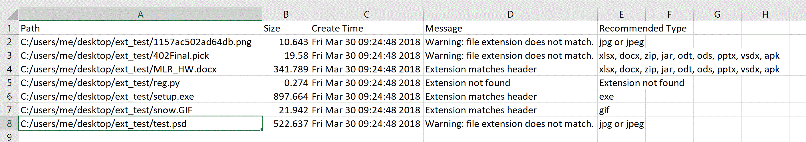
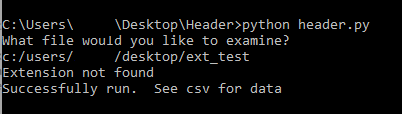

# Header
A free, open-source program to check the hex header against the extension given.

<h2>Why we care about extensions</h2>

As a digital forensics examiner, our job is to find anything suspicious on a suspect's computer (within our warrant of course).
Suspects may attempt to hide files from us by changing the extension of the file so it doesn't look suspicious.  For example,
in child pornography cases, criminals often change the extensions of their obscene images from a .jpg or .png to a .exe or
something else.  

<h2>How it works</h2>

This program iterates through a directory of files and checks the extensions.  It converts the file to hex and then pulls of the
first few hex characters.  The number of characters pulled out is based on the first four characters of the string as each extension
a unique beginning.  It then checks this header against a list of headers to see if the header meatches the extension given.  If it does
not, then the message is set to "Warning: file extension does not match.".  The program then checks to see what the file type actually is 
based on the header and prints this and several other pieces of information out to a .csv.  The results will look something like this:

<h2>Running header.py</h2>

Running header.py is rather simple as it currently runs from the command prompt.  Cd into the correct directory then run 

Windows:
<code>python header.py</code>

Mac and Linux:
<code>python3 header.py</code>

Give it a directory name when it asks and it will do the rest.  Then open up the .csv and view your results.

<h2>Looking forward</h2>

As you can see, the program only covers about 20 headers.  In the near future I plan to add functionality for more headers (taken from
<a href="https://en.wikipedia.org/wiki/List_of_file_signatures">here</a>.)

I will also add functionality to iterate through subdirectories as well.

